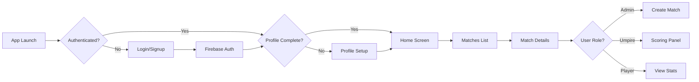

<div align="center">
  
  
  # 🏏 Crease
  
  ### *Where Every Ball Counts*
  
  <p align="center">
    <strong>A cutting-edge mobile platform for cricket club management, live scoring, and match administration</strong>
  </p>
  
  <p align="center">
    
    
    
    
  </p>
  
  <p align="center">
    <a href="#-features">Features</a> •
    <a href="#-quick-start">Quick Start</a> •
    <a href="#-documentation">Documentation</a> •
    <a href="#-tech-stack">Tech Stack</a> •
    <a href="#-contributing">Contributing</a>
  </p>
  
  
</div>

---

## 📱 What is Crease?

Crease is a **production-ready** React Native application designed for cricket enthusiasts, clubs, and tournament organizers. Built with modern technologies and best practices, it provides real-time match scoring, comprehensive player statistics, and seamless match management—all in the palm of your hand.

> 🎯 **Mission:** To revolutionize cricket club management by providing an intuitive, real-time, and feature-rich mobile experience.

---

## ✨ Features

<table>
  <tr>
    <td width="50%">
      
### 🔐 Authentication & Security
- ✅ Secure email/password authentication
- ✅ Role-based access control (Admin/President/Umpire/Player)
- ✅ Automated route guarding
- ✅ Profile management with student ID verification

### 📊 Live Match Scoring
- ✅ Real-time score updates via Firestore
- ✅ Ball-by-ball commentary
- ✅ Wicket tracking with dismissal types
- ✅ Over-by-over statistics
- ✅ Live leaderboards

    </td>
    <td width="50%">
      
### 🏆 Match Management
- ✅ Create and schedule matches
- ✅ Team and umpire assignment
- ✅ Match status tracking (Upcoming/Live/Completed)
- ✅ Comprehensive match statistics
- ✅ Player performance analytics

### 🎨 Modern UI/UX
- ✅ Beautiful, intuitive interface
- ✅ Pull-to-refresh functionality
- ✅ Countdown timers for upcoming matches
- ✅ Responsive design
- ✅ Smooth animations

    </td>
  </tr>
</table>

---

## 🚀 Quick Start

### Prerequisites

Before you begin, ensure you have:

- **Node.js** (v16 or higher) - [Download](https://nodejs.org/)
- **npm** or **yarn**
- **Expo CLI** - Install via `npm install -g expo-cli`
- **Firebase Project** with Authentication & Firestore enabled

### Installation

```bash
# 1. Clone the repository
git clone https://github.com/yourusername/crease.git
cd crease

# 2. Install dependencies
npm install

# 3. Configure Firebase (see below)
cp .env.example .env
# Edit .env with your Firebase credentials

# 4. Start development server
npm start

# 5. Run on device
# Press 'i' for iOS simulator
# Press 'a' for Android emulator
# Scan QR code with Expo Go for physical device
```

### 🔥 Firebase Configuration

Create a `.env` file in the root directory:

```env
EXPO_PUBLIC_FIREBASE_API_KEY=your_api_key_here
EXPO_PUBLIC_FIREBASE_AUTH_DOMAIN=your_project_id.firebaseapp.com
EXPO_PUBLIC_FIREBASE_PROJECT_ID=your_project_id
EXPO_PUBLIC_FIREBASE_STORAGE_BUCKET=your_project_id.appspot.com
EXPO_PUBLIC_FIREBASE_MESSAGING_SENDER_ID=your_sender_id
EXPO_PUBLIC_FIREBASE_APP_ID=your_app_id
```

> 💡 **Tip:** Find these values in your Firebase Console under Project Settings → Your Apps → SDK setup and configuration

---

## 📚 Documentation

<div align="center">
  
| 📖 Guide | 📝 Description |
|---------|---------------|
| **[Complete Wiki](wiki/)** | Comprehensive documentation hub |
| **[Getting Started](wiki/Getting-Started.md)** | Detailed setup and installation |
| **[Architecture](wiki/Project-Architecture.md)** | System design and patterns |
| **[Contributing](wiki/Contribution-Guide.md)** | Contribution guidelines |
| **[Roadmap](wiki/Roadmap.md)** | Future features and plans |
| **[Testing Guide](TESTING_GUIDE.md)** | Testing strategies |

</div>

---

## 🛠️ Tech Stack

<div align="center">

### Core Technologies

| Technology | Version | Purpose |
|-----------|---------|---------|
|  | 0.73.2 | Mobile Framework |
|  | ~50.0.0 | Development Platform |
|  | 5.1.3 | Type Safety |
|  | 10.7.1 | Backend Services |
|  | ~3.4.0 | Navigation |

### Firebase Services

- 🔐 **Authentication** - Email/password auth
- 🗄️ **Cloud Firestore** - Real-time database
- 📊 **Real-time Listeners** - Live data synchronization
- 🔒 **Security Rules** - Access control

</div>

---

## 📁 Project Structure

```
🏏 crease/
│
├── 📱 app/                      # Expo Router routes
│   ├── (auth)/                 # Authentication flow
│   │   ├── login.tsx
│   │   └── signup.tsx
│   ├── (tabs)/                 # Tab navigation
│   │   ├── index.tsx           # Home screen
│   │   ├── search.tsx          # Search players/teams
│   │   └── profile.tsx         # User profile
│   ├── admin/                  # Admin features
│   │   └── create-match.tsx
│   ├── umpire/                 # Live scoring
│   │   └── [id].tsx
│   ├── match/                  # Match details
│   │   └── [id].tsx
│   └── _layout.tsx             # Root layout
│
├── 🎨 src/
│   ├── components/             # Reusable UI components
│   │   ├── Button.tsx
│   │   ├── Input.tsx
│   │   ├── CountdownTimer.tsx
│   │   └── match-stats/        # Match statistics components
│   ├── firebase/               # Firebase configuration
│   │   ├── config.ts
│   │   ├── auth.ts
│   │   └── firestore.ts
│   ├── models/                 # TypeScript interfaces
│   │   ├── User.ts
│   │   └── Match.ts
│   ├── providers/              # Context providers
│   │   └── AuthProvider.tsx
│   ├── services/               # Business logic
│   │   ├── users.ts
│   │   └── matches.ts
│   └── utils/                  # Helper functions
│
├── 📖 wiki/                     # Documentation
├── 🔧 app.config.ts             # Expo configuration
└── 📦 package.json
```

---

## 🔄 Authentication Flow



---

## 🗄️ Database Schema

<details>
<summary><b>👤 Users Collection</b></summary>

```typescript
users/{uid}
{
  uid: string;
  name: string;
  email: string;
  studentId: string;
  username: string;
  role: 'player' | 'admin' | 'president' | 'umpire';
  createdAt: Timestamp;
  updatedAt: Timestamp;
}
```
</details>

<details>
<summary><b>🏏 Matches Collection</b></summary>

```typescript
matches/{matchId}
{
  status: 'upcoming' | 'live' | 'completed';
  scheduledDate: Timestamp;
  createdBy: string;
  umpireUid: string;
  teamA: {
    name: string;
    playerUids: string[];
  };
  teamB: {
    name: string;
    playerUids: string[];
  };
  teamAInnings: InningsScore;
  teamBInnings: InningsScore;
  currentInnings: 1 | 2;
  battingTeam: 'teamA' | 'teamB';
  totalOvers: number;
  ballEvents: BallEvent[];
  createdAt: Timestamp;
  updatedAt: Timestamp;
}
```
</details>

---

## 🎯 Key Features Explained

### 🔴 Live Scoring Panel

The umpire scoring panel provides a comprehensive interface for real-time match scoring:

- **Ball-by-ball input** with runs (0-6), wickets, extras, and no-balls
- **Real-time synchronization** - All connected devices see updates instantly
- **Undo functionality** - Correct mistakes easily
- **Over completion** - Automatic bowler rotation prompts
- **Innings tracking** - Seamless transition between innings

### 📊 Match Statistics

Detailed match statistics including:

- **Batting Analysis** - Runs, balls faced, strike rate, boundaries
- **Bowling Analysis** - Overs, wickets, economy, maidens
- **Partnerships** - Run contributions between batsmen
- **Fall of Wickets** - Dismissal timeline
- **Over Summary** - Visual charts and graphs
- **Player Highlights** - Top performers

### 🔍 Advanced Search

Multi-tab search functionality:

- **Player Search** - Find players by name or username
- **Team Search** - Search teams and view recent matches
- **Match Search** - Search by team names
- **Recent Searches** - Quick access to previous searches
- **New Talents** - Discover recently joined players

---

## 🤝 Contributing

We welcome contributions! Here's how you can help:

1. **Fork** the repository
2. **Create** a feature branch (`git checkout -b feature/AmazingFeature`)
3. **Commit** your changes (`git commit -m 'Add some AmazingFeature'`)
4. **Push** to the branch (`git push origin feature/AmazingFeature`)
5. **Open** a Pull Request

Please read our [Contribution Guidelines](wiki/Contribution-Guide.md) for more details.

---

## 📱 Screenshots

<div align="center">
  <p><i>Coming Soon! Screenshots will be added here.</i></p>
</div>

---

## 🗺️ Roadmap

- [ ] **Player Statistics Dashboard** - Comprehensive player analytics
- [ ] **Tournament Management** - Multi-match tournament support
- [ ] **Push Notifications** - Match updates and alerts
- [ ] **Social Features** - Player profiles and social interactions
- [ ] **Video Highlights** - Upload and share match highlights
- [ ] **Analytics Dashboard** - Team and player performance insights
- [ ] **Offline Mode** - Continue scoring without internet

See the full [Roadmap](wiki/Roadmap.md) for more details.

---

## 📄 License

This project is licensed under the **MIT License** - see the [LICENSE](LICENSE) file for details.

---

## 🙏 Acknowledgments

- Made with ❤️ by **abhie2005** & **Krushang1818**
- Built with ❤️ using [Expo](https://expo.dev/)
- Powered by [Firebase](https://firebase.google.com/)
- Icons from [Ionicons](https://ionic.io/ionicons)

---

<div align="center">
  
  ### 🌟 Star this repository if you find it helpful!
  
  <p>
    <a href="https://github.com/yourusername/crease/stargazers">
      
    </a>
    <a href="https://github.com/yourusername/crease/network/members">
      
    </a>
  </p>
  
  **Made with 🏏 by the Crease Team**
  
  
  
  <sub>Built with React Native • Powered by Firebase • Designed for Cricket Lovers</sub>
  
</div>
