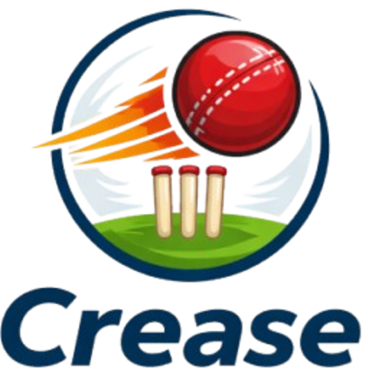
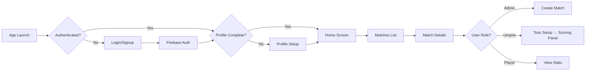

<div align="center">
  

  # Crease

  ### *Where Every Ball Counts*

  <p align="center">
    <strong>A cutting edge mobile platform for cricket club management, live scoring, and match administration</strong>
  </p>

  <p align="center">
    
    
    
    
  </p>

  <p align="center">
    <a href="#features">Features</a> •
    <a href="#quick-start">Quick Start</a> •
    <a href="#documentation">Documentation</a> •
    <a href="#tech-stack">Tech Stack</a> •
    <a href="#contributing">Contributing</a>
  </p>

  
</div>

---

## What is Crease?

Crease is a **production-ready** React Native application designed for cricket enthusiasts, clubs, and tournament organizers. Built with modern technologies and best practices, it provides real-time match scoring, comprehensive player statistics, and seamless match management—all in the palm of your hand.

> **Mission:** To revolutionize cricket club management by providing an intuitive, real-time, and feature-rich mobile experience.

---

## Features

<table>
  <tr>
    <td width="50%">

### Authentication and Security
- Secure email/password authentication
- Role-based access control (Admin/President/Umpire/Player)
- Automated route guarding
- Profile management with student ID verification
- Username-based public profiles

### Live Match Scoring
- Real-time score updates via Firestore
- Ball-by-ball commentary
- Wicket tracking with dismissal types
- Over-by-over statistics
- Live leaderboards
- Toss management (coin flip, team selection, opening batsmen)

    </td>
    <td width="50%">

### Match Management
- Create and schedule matches with date/time picker
- Team and umpire assignment
- Match status tracking (Upcoming/Live/Completed)
- Comprehensive match statistics
- Player performance analytics
- Innings tracking with target display

### Modern UI/UX
- Dark and light theme with persistent preference
- ESPN-style sectioned match list (Live / Upcoming / Final)
- Pull-to-refresh functionality
- Countdown timers for upcoming matches
- Responsive design with smooth animations
- Themed gradient backgrounds

### Player Profiles and Privacy
- Pinned performance highlight
- Recently played matches section
- Full match history
- Privacy toggles (show/hide sections from public)
- Public profile lookup by username

    </td>
  </tr>
</table>

---

## Quick Start

### Prerequisites

Before you begin, ensure you have

- **Node.js** (v16 or higher) - [Download](https://nodejs.org/)
- **npm** or **yarn**
- **Expo CLI** - Install via `npm install -g expo-cli`
- **Firebase Project** with Authentication & Firestore enabled

### Installation

```bash
# 1. Clone the repository
git clone https://github.com/abhie2005/crease.git
cd crease

# 2. Install dependencies
npm install

# 3. Configure Firebase (see below)
cp .env.example .env
# Edit .env with your Firebase credentials

# 4. Start development server
npm start

# 5. Run on device
# Press 'i' for iOS simulator
# Press 'a' for Android emulator
# Scan QR code with Expo Go for physical device
```

### Firebase Configuration

Create a `.env` file in the root directory:

```env
Need Permission
```

> **Tip:** Find these values in your Firebase Console under Project Settings → Your Apps → SDK setup and configuration.

---

## Documentation

<div align="center">

| Guide | Description |
|-------|-------------|
| **[Complete Wiki](wiki/)** | Comprehensive documentation hub |
| **[Getting Started](wiki/Getting-Started.md)** | Detailed setup and installation |
| **[Architecture](wiki/Project-Architecture.md)** | System design and patterns |
| **[Contributing](wiki/Contribution-Guide.md)** | Contribution guidelines |
| **[Roadmap](wiki/Roadmap.md)** | Future features and plans |
| **[Testing Guide](TESTING_GUIDE.md)** | Testing strategies |

</div>

---

## Tech Stack

<div align="center">

### Core Technologies

| Technology | Version | Purpose |
|-----------|---------|---------|
|  | 0.73.2 | Mobile Framework |
|  | ~50.0.0 | Development Platform |
|  | 5.1.3 | Type Safety |
|  | 10.7.1 | Backend Services |
|  | ~3.4.0 | File-based Navigation |

### UI and Visualization

| Library | Version | Purpose |
|---------|---------|---------|
| expo-linear-gradient | ~13.0.0 | Themed gradient backgrounds |
| react-native-chart-kit | ^6.12.0 | Match statistics charts |
| react-native-svg | ^15.15.1 | SVG support for charts |
| @expo/vector-icons | (bundled) | Ionicons icon set |

### Firebase Services

- **Authentication** — Email/password auth with AsyncStorage persistence
- **Cloud Firestore** — Real-time database with typed collection refs
- **Real-time Listeners** — Live data synchronization across devices
- **Security Rules** — Role-based access control

</div>

---

## Project Structure

```
crease/
│
├── app/                         # Expo Router routes
│   ├── (auth)/                  # Authentication flow
│   │   ├── login.tsx
│   │   └── signup.tsx
│   ├── (tabs)/                  # Bottom tab navigation
│   │   ├── index.tsx             # Home — live/upcoming/final matches
│   │   ├── search.tsx            # Search players, teams, matches
│   │   └── profile.tsx           # User profile with stats
│   ├── admin/
│   │   └── create-match.tsx      # Create match (admin/president only)
│   ├── match/
│   │   └── [id].tsx              # Match details with real-time updates
│   ├── umpire/
│   │   ├── [id].tsx              # Live scoring panel (umpire only)
│   │   └── toss/[id].tsx         # Toss setup — coin flip, opening batsmen
│   ├── profile/
│   │   ├── setup.tsx             # Profile creation / edit
│   │   └── settings.tsx          # Privacy settings
│   ├── user/
│   │   └── [username].tsx        # Public profile by username
│   └── _layout.tsx              # Root layout with route guards
│
├── src/
│   ├── components/              # Reusable UI components
│   │   ├── Button.tsx
│   │   ├── Input.tsx
│   │   ├── CountdownTimer.tsx
│   │   ├── DateTimePicker.tsx
│   │   ├── ThemedBackground.tsx
│   │   ├── match-stats/         # Match statistics components
│   │   │   ├── MatchStatsView.tsx
│   │   │   ├── BattingStatsTable.tsx
│   │   │   ├── BowlingStatsTable.tsx
│   │   │   ├── OverSummary.tsx
│   │   │   ├── Partnerships.tsx
│   │   │   ├── FallOfWickets.tsx
│   │   │   ├── ExtrasBreakdown.tsx
│   │   │   ├── MatchHighlights.tsx
│   │   │   ├── TeamComparison.tsx
│   │   │   └── UpcomingMatchStatsView.tsx
│   │   ├── profile/             # Profile section components
│   │   │   ├── ProfileContent.tsx
│   │   │   ├── RecentlyPlayedSection.tsx
│   │   │   ├── PinnedPerformanceSection.tsx
│   │   │   └── MatchHistorySection.tsx
│   │   └── search/              # Search result cards
│   │       ├── PlayerResultCard.tsx
│   │       ├── TeamResultCard.tsx
│   │       └── MatchResultCard.tsx
│   ├── firebase/                # Firebase configuration
│   │   ├── config.ts
│   │   ├── auth.ts
│   │   └── firestore.ts
│   ├── hooks/
│   │   └── useSafeAreaHeader.ts
│   ├── models/                  # TypeScript interfaces
│   │   ├── User.ts
│   │   └── Match.ts
│   ├── providers/               # Context providers
│   │   ├── AuthProvider.tsx
│   │   └── ThemeProvider.tsx    # Dark/light mode with AsyncStorage persistence
│   ├── services/                # Business logic
│   │   ├── users.ts
│   │   ├── matches.ts
│   │   ├── matchStats.ts
│   │   └── playerStats.ts
│   ├── theme/
│   │   └── colors.ts            # Dark and light theme color palettes
│   ├── types/                   # Shared TypeScript type definitions
│   └── utils/
│       ├── recentSearches.ts
│       └── usernameValidation.ts
│
├── app.config.ts                # Expo configuration
└── package.json
```

---

## Authentication Flow


```mermaid
graph LR
    A[App Launch] --> B{Authenticated?}
    B -->|No| C[Login/Signup]
    B -->|Yes| D{Profile Complete?}
    C --> E[Firebase Auth]
    E --> D
    D -->|No| F[Profile Setup]
    D -->|Yes| G[Home Screen]
    F --> G
    G --> H[Matches List]
    H --> I[Match Details]
    I --> J{User Role?}
    J -->|Admin| K[Create Match]
    J -->|Umpire| L[Toss Setup → Scoring Panel]
    J -->|Player| M[View Stats]
```

---

## Database Schema

<details>
<summary><b>Users Collection</b></summary>

```typescript
users/{uid}
{
  uid: string;
  name: string;
  email: string;
  studentId: string;
  username: string;
  role: 'player' | 'admin' | 'president' | 'umpire';
  pinnedPerformance?: { matchId: string; type: 'batting' | 'bowling' };
  showRecentlyPlayed?: boolean;
  showMatchHistory?: boolean;
  showPinnedPerformance?: boolean;
  createdAt: Timestamp;
  updatedAt: Timestamp;
}
```
</details>

<details>
<summary><b>Matches Collection</b></summary>

```typescript
matches/{matchId}
{
  status: 'upcoming' | 'live' | 'completed';
  scheduledDate: Timestamp;
  createdBy: string;
  umpireUid: string;
  teamA: {
    name: string;
    playerUids: string[];
  };
  teamB: {
    name: string;
    playerUids: string[];
  };
  teamAInnings: InningsScore;
  teamBInnings: InningsScore;
  currentInnings: 1 | 2;
  battingTeam: 'teamA' | 'teamB';
  totalOvers: number;
  ballEvents: BallEvent[];
  createdAt: Timestamp;
  updatedAt: Timestamp;
}
```
</details>

---

## Key Features Explained

### Toss and Match Setup

Before live scoring begins, the umpire conducts the toss:

- **Coin flip animation** — visual toss simulation
- **Toss winner selection** — choose which team won
- **Bat or bowl decision** — winning team decides
- **Opening batsmen selection** — pick two openers from the batting team
- **On-strike choice** — designate which batsman faces the first ball

### Live Scoring Panel

The umpire scoring panel provides a comprehensive interface for real-time match scoring:

- **Ball-by-ball input** with runs (0-6), wickets, extras, and no-balls
- **Real-time synchronization** - All connected devices see updates instantly
- **Undo functionality** - Correct mistakes easily
- **Over completion** - Automatic bowler rotation prompts
- **Innings tracking** - Seamless transition between innings
- **Target display** - Second innings shows runs needed

### Match Statistics

Detailed match statistics including:

- **Batting Analysis** - Runs, balls faced, strike rate, boundaries
- **Bowling Analysis** - Overs, wickets, economy, maidens
- **Partnerships** - Run contributions between batsmen
- **Fall of Wickets** - Dismissal timeline
- **Over Summary** - Visual charts and graphs
- **Player Highlights** - Top performers
- **Team Comparison** - Side-by-side innings breakdown
- **Extras Breakdown** - Wides, no-balls, byes, leg-byes

### Player Profiles

Rich profiles visible to all users (respecting privacy settings):

- **Pinned Performance** - Highlight one batting or bowling effort
- **Recently Played** - Latest matches at a glance
- **Match History** - Full career log
- **Privacy Controls** - Toggle each section on/off for public viewers

### Advanced Search

Multi-tab search functionality:

- **Player Search** - Find players by name or username
- **Team Search** - Search teams and view recent matches
- **Match Search** - Search by team names
- **Recent Searches** - Quick access to previous searches (persisted locally)
- **New Talents** - Discover the five most recently joined players

### Dark / Light Theme

- System-respecting default (dark mode)
- Toggle from the Profile tab instantly
- Preference persisted via AsyncStorage across sessions
- Consistent themed gradient backgrounds throughout the app

---

## Contributing

We welcome contributions! Here's how you can help:

1. **Fork** the repository
2. **Create** a feature branch (`git checkout -b feature/AmazingFeature`)
3. **Commit** your changes (`git commit -m 'Add some AmazingFeature'`)
4. **Push** to the branch (`git push origin feature/AmazingFeature`)
5. **Open** a Pull Request

Please read our [Contribution Guidelines](wiki/Contribution-Guide.md) for more details.

---

## Screenshots

<div align="center">
  <p><i>Coming Soon !</i></p>
</div>

---

## Roadmap

- [ ] **Tournament Management** - Multi-match tournament support
- [ ] **Push Notifications** - Match updates and alerts
- [ ] **Social Features** - Comments and reactions on match events
- [ ] **Video Highlights** - Upload and share match highlights
- [ ] **Analytics Dashboard** - Team and player performance insights over time
- [ ] **Offline Mode** - Continue scoring without internet
- [ ] **Awards / Gallery** - Team photo albums and season awards

See the full [Roadmap](wiki/Roadmap.md) for more details.

---

## License

This project is licensed under the **MIT License** - see the [LICENSE](LICENSE) file for details.

---

## Acknowledgments

- Made by **abhie2005** and **Krushang1818**

---

<div align="center">

  ### Star this repository if you find it helpful

  <p>
    <a href="https://github.com/abhie2005/crease/stargazers">
      
    </a>
    <a href="https://github.com/abhie2005/crease/network/members">
      
    </a>
  </p>

  **Crease Team**

  

  <sub>Built with React Native · Powered by Firebase · Designed for Cricket</sub>

</div>
